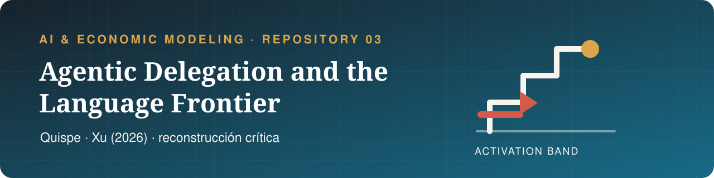

  

  
  
  

  
  
  

  
  
  
  

# Repository 3 — Quispe & Xu (2026)

> **Alexander Quispe y Kevin Xu.** *Agentic Delegation and the Language Frontier of Software Developers: A Model and Evidence from Claude Code on GitHub*. arXiv:2605.25438v2, julio de 2026. La evidencia es observacional y los autores la presentan como asociación en event time, no como efecto causal definitivo.

**Pregunta.** ¿La adopción de un asistente que ejecuta tareas amplía el conjunto de lenguajes en los que un desarrollador produce, más allá de la asistencia conversacional ya disponible? Quispe y Xu estudian 5,346 desarrolladores y miden lenguajes desde 57.2 millones de archivos cambiados. Encuentran saltos en el mes de adopción de Claude Code de 2.528 lenguajes activos, 1.193 lenguajes nuevos y 0.382 puntos de entropía, sobre medias pretratamiento de 0.90, 0.31 y 0.15, respectivamente (tablas 1-2 y secciones 5.5 y 7, PDF pp. 24, 30-33).

## Problema del agente

Para cada desarrollador (i), lenguaje (k) y mes (t), el agente escoge no entrar o el modo con mayor excedente de certeza equivalente:

\[
m^g_{ikt}\in\arg\max_{m\in M_g\cup\{\varnothing\}}\{V^m_{ikt},0\},
\quad M_1=\{S,C\},\quad M_2=\{S,C,D\},
\]

\[
\begin{aligned}
V^S&=\omega+s\mu-\rho s^2/(2\pi)-b,\\
V^C&=V^S+\gamma s-r_C,\\
V^D&=\omega+(1-\lambda)s\mu+\lambda az(A)-\kappa(a,s)-r_D-b
-\frac{\rho}{2}\left[(1-\lambda)^2s^2/\pi+\sigma_D^2(a,s,A)\right].
\end{aligned}
\]

El lenguaje está activo si (max_{m\in M_g}V^m\ge0). Aquí (s\in[0,1]), (a\ge0), (\rho>0), (\lambda\in(0,1]), (\pi>0), y (\theta\sim N(\mu,1/\pi)) (sección 4.1, PDF pp. 13-14).

## Resultado principal, con todas sus condiciones

La Proposición 2 considera **un lenguaje no familiar** que satisface el **Supuesto 1**, (\gamma s-r_C\le0), por lo que (T^1=T^S), donde

\[
T^S=b-s\mu+\frac{\rho s^2}{2\pi},\qquad
T^D=b-(1-\lambda)s\mu-\lambda az(A)+\kappa+r_D+
\frac{\rho}{2}\left[\frac{(1-\lambda)^2s^2}{\pi}+\sigma_D^2\right].
\]

Si, además, (B\equiv T^S-T^D>0), entonces

\[
Z^2-Z^1=\mathbf1\{T^D\le\omega<T^S\}.
\]

Si la CDF condicional (F) de (\omega) es continua, la probabilidad de activación es (F(T^S)-F(T^D)). Al sumar lenguajes, la expansión esperada es débilmente no negativa. Expansión estricta requiere masa positiva de oportunidades dentro de al menos una banda; continuidad por sí sola no la garantiza (Proposición 2 y ecuaciones 8-9, PDF pp. 15-16).

## Objeción principal y veredicto

Los outcomes identifican una reducción de umbral, no la agencia. Un shock genérico que reduzca el costo de entrada en (q=B) produce la misma banda, las mismas comparativas y la misma concentración entre especialistas. El paper aporta estructura agéntica dentro de (B), pero no observa sus componentes ni incluye un placebo chat-versus-agente. Además, el timing es voluntario: el stock acumulado tiene pre-trends y la actividad sube en (e=-1) (secciones 7.3 y 10.2-10.7, PDF pp. 33, 50-53). Veredicto: los datos sostienen una asociación robusta entre primera coautoría detectable y diversificación, pero no que Claude la causó ni que delegación fue el mecanismo único. La formalización también detecta un endpoint falso en la Proposición 3: con (p^1=0,p^2=1,U_i=1), (\Delta C_i(s)=1) para todo (s), contra el crecimiento y la concavidad estrictos declarados (Proposición 3 y apéndice A.6, PDF pp. 17 y 63-64).

[Deck](presentation.pdf) · [Formalización Lean](lean/) · [Análisis completo](analysis.md) · [Simulación](sim.py)
